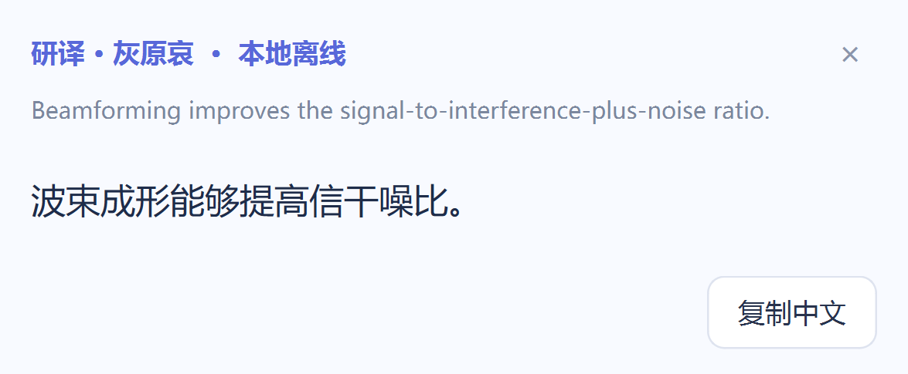
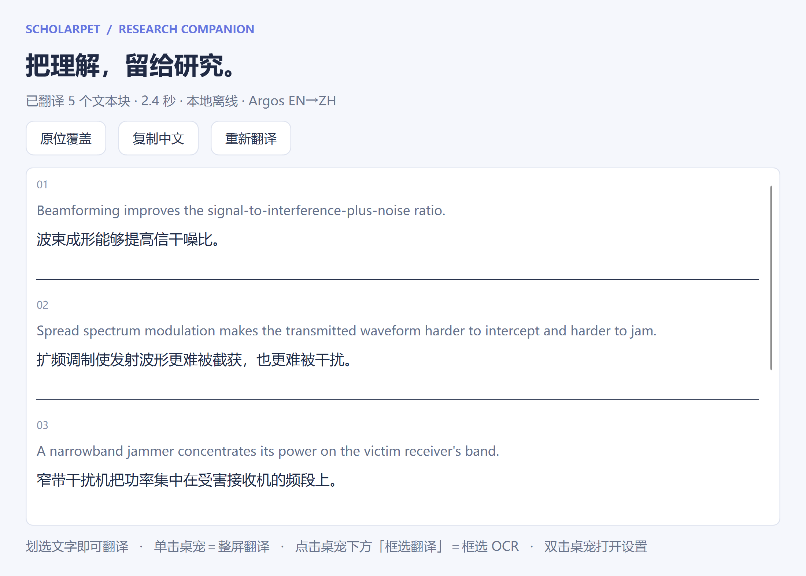
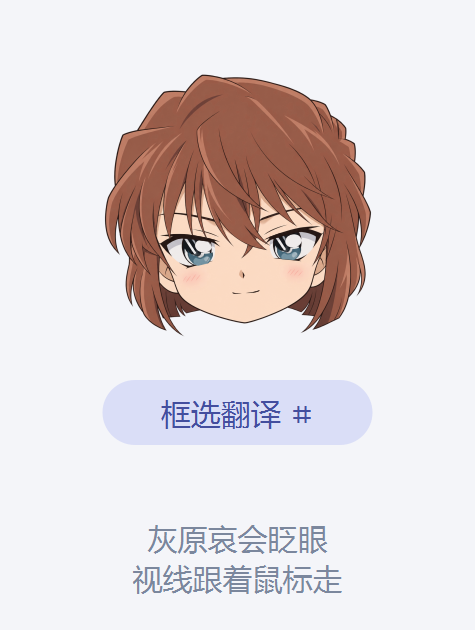
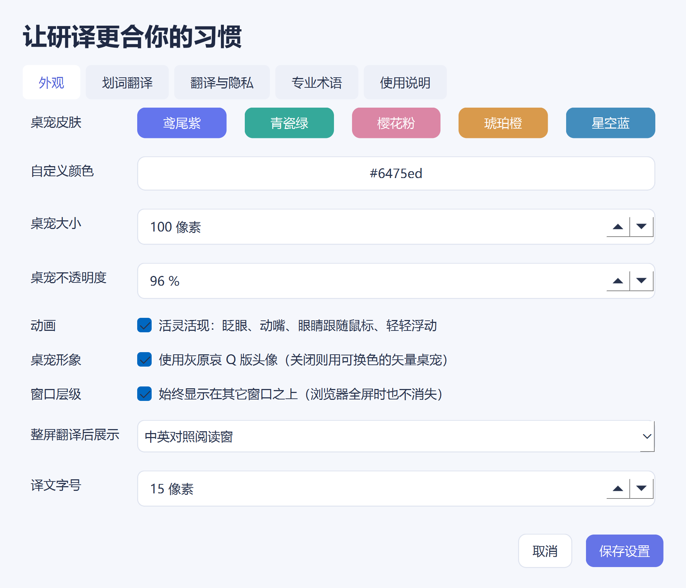

# 研译 ScholarPet

面向论文阅读的 Windows 桌宠翻译器。核心用法只有一句话：**在论文、网页或技术报告里用鼠标划过英文，中文译文就在鼠标旁边弹出来。**

它把截图和 OCR 留在这台电脑上，只把识别出的文字发给翻译服务。默认使用随项目提供的 Argos 英中离线模型，不需要网络也不需要 API Key；也可以在设置里切到 Google 实验性接口，或你自己的 DeepSeek / OpenAI 兼容 API。

## 下载

**[点这里下载最新版 ScholarPet-Windows-x64.zip（约 215 MB）](https://github.com/sherryalbert/ScholarPet/releases/latest)**

解压到任意目录，双击里面的 `ScholarPet.exe` 就能用，**不需要安装 Python**。首次运行 Windows 会弹 SmartScreen 蓝框，点「更多信息」→「仍要运行」。系统要求 Windows 10 / 11 64 位。

> **右上角绿色的 `Code` → `Download ZIP` 下的是源代码，不是软件。**
> 那是给开发者的：里面只有 `.py` 文件，要自己装 Python 3.12、装依赖、下模型才能跑起来。
> 只想用软件的话，请用上面这个 Releases 链接。原因见 [`docs/UPDATING.md`](docs/UPDATING.md#三绝对不能提交的东西)。

## 界面

划词翻译浮窗，出现在鼠标旁边，不遮挡你选中的那句话：



中英对照阅读窗，整段翻译后逐块核对原文：



左边是桌宠，双击她打开右边这套设置：

<table>
<tr>
<td></td>
<td></td>
</tr>
</table>

（截图为示意，由 `python scripts\preview_ui.py` 直接从真实控件渲染。）

## 使用

在 Windows 上运行 `run.py`，或直接运行构建产物 `dist/ScholarPet/ScholarPet.exe`。首次启动会在屏幕右下角出现灰原哀桌宠。

### 主入口：划词翻译

- 双击一个英文单词，或按住鼠标拖动划过一句话 / 一整段，译文浮窗立刻出现在鼠标旁边；
- 浮窗**不遮挡你选中的内容**，也**不会抢走输入焦点**，可以马上继续滚动页面；
- 读完译文后，在浮窗以外的**任何地方单击左键**，浮窗立刻收起；点浮窗内部（`复制中文` / `完整对照`）不受影响；
- 浮窗上可「复制中文」；选中的文字较长时会出现「完整对照」，打开整段中英对照窗；
- 扫描版 PDF 没有文字层，浮窗会明确提示改用「框选翻译」，而不是默默没反应；
- 终端、密码框和凭据窗口会被自动跳过，不会误发 Ctrl+C；截图类工具（Snipping Tool、Snipaste 等）的框选也不会被当成划词。

### 四个动作，零快捷键

研译**不注册任何全局快捷键**，不会和其他软件抢 `Ctrl+Alt+*`，也不需要你记住任何组合键：

- **鼠标划选** —— 选中哪里就翻译哪里，是主入口；
- **单击灰原哀头像** —— 翻译当前整屏；
- **点击头像下方的「框选翻译」** —— 拖动框选任意区域走 OCR，扫描版 PDF 用这个；
- **双击头像** —— 打开外观、划词、翻译引擎和通信抗干扰术语表设置。

拖动头像移动位置；右键头像弹出更多功能（含「翻译剪贴板文字」）；`Esc` 关闭浮窗 / 覆盖层 / 取消框选。

### 剪贴板只借不占

划词翻译靠给前台应用发一次 `Ctrl+C`、再把文字读回来，但**剪贴板是你自己的**：截图（`Win+Shift+S`、`PrtSc`）也落在同一块剪贴板上，所以这段逻辑绝不能把它抹掉。

- **不预先清空**。Windows 每次 `SetClipboardData` 都会推进一个剪贴板序号，"目标应用到底有没有响应 Ctrl+C"直接读这个序号就知道；序号没动就说明按键被忽略，剪贴板原封未动，什么都不用还原。
- **只有真被替换过才还原**，并在还原前再核对一次序号——如果你在这几十毫秒里又截了一张图，新内容属于你，旧快照不会覆盖它。
- **位图要能原样放回**。`QMimeData` 的 `data()` / `setData()` 往返会把位图丢掉（截图所在格式读回来是空的，而 PySide6 没有暴露 `QMimeData.setImage`），必须用 `setImageData` 保留 `QImage` 本身，微信、QQ 才拿得到真正的 `CF_DIB`。

此前正是"先 `clear()`、再回填一个存不住位图的快照"，导致截图后粘到微信 / QQ 毫无反应。

原位覆盖层可以「按住看原文」快速对照，也可切到「中英对照」阅读窗。桌宠、翻译浮窗、框选层和快照层都有独立的置顶保活：**浏览器按 F11 全屏或 PDF 阅读器全屏时它们依然在画面上**（Qt 只在创建窗口时应用一次置顶，全屏窗口之后会重排层级，所以这里每 1.2 秒重新确认一次）。

桌宠画像是 1254×1254 的原图，只做**一次**高质量降采样并按设备像素比缓存，所以不会糊也不会每帧重算；皮肤颜色体现在头像下方的状态药丸上，悬停/翻译时才出现跟随发型的柔光描边，**不会在头像周围画圆圈**。

合成用的画布是跨帧复用的：它返回给调用方时会带上设备像素比，于是**下一帧基于它新建的画笔会继承这个比值，把每个图层再放大一次**（1.25 缩放屏上正好放大 1.2444 倍，只剩左上 80%——表现就是脸被裁掉、只露中间一段）。所以合成前把画布比值复位为 1.0、按原始设备像素画，画完再设回去。这个坑只在**第 2 帧之后**才出现，任何只渲染首帧的检查都会全绿，故 `scripts/preview_pet.py` 特意把同一个姿态连画两帧做逐帧比对。

### 桌宠会动

灰原哀不是一张贴图，她会眨眼。做法是**面部骨骼绑定**：从原图里按像素抠出可动的部件（虹膜、睫毛、唇线、刘海），动画只移动和覆盖这些部件，**绝不重绘**，所以任何一帧都还是这张原画。

- **眨眼**：每 2.2–6.6 秒自己眨一次，18% 的概率连眨两下。上睑由原图睫毛层整体下移承担，闭眼处用**杏仁形裁剪**留出眼缝而不是直边切断，眼睑走过的位置先铺开脸颊皮肤、再把刘海画回最上层——否则眨一次会刮掉眼上方的头发。
- **点击回应**：单击头像，她会立刻眨一下眼回应你。
- **视线跟随**：虹膜在原眼白范围内小幅偏移（不超过眼宽的 8.5%），跟着鼠标走；鼠标离得太远或移出屏幕就自然回正，随机会有轻微漂移。
- **动嘴唇**：翻译进行中（含 OCR）轻轻张口，幅度由正弦包络控制；原图唇线始终盖在最上层，所以嘴形还是她本来的嘴，不会被拉变形。

这些动作幅度都刻意做得很小：眨眼只影响约 3% 的像素，张嘴约 0.4%。设置里可以关掉「活灵活现」开关，关掉后控件降到 1fps、直接显示原图，不产生任何合成开销。

## 隐私

截图与 OCR 全部在本机完成。不会自动保存截图、译文或历史记录。API Key 使用 Windows DPAPI 加密保存在本机设置文件中，不进入仓库、也不随程序分发。未公开论文、实验数据和受限页面建议使用本地离线模型；在线模式只把 OCR / 选区识别出的文字发送到你选择的服务。

划词翻译读取选区的方式是：向当前应用发送一次复制、读回剪贴板，并且只在剪贴板确实被这次复制改写时才把原内容放回去（详见上文「剪贴板只借不占」）——如果你刚用 `Win+Shift+S` 截了图，那张图不会被抹掉。它不安装键盘钩子，不记录按键。

## 已知边界

机器翻译和 OCR 都可能出错，公式、图表、扫描件和关键科研结论请在中英对照窗里核对原文。翻译对象是屏幕当前可见内容，滚动或翻页后需要重新翻译一次。受操作系统保护的安全桌面与硬件加速视频表面无法截图。

## 开发

```powershell
py -m venv .venv
.\.venv\Scripts\Activate.ps1
pip install -r requirements-dev.txt
python scripts\fetch_model.py       # 取离线英中模型（约 82 MB，不入版本控制）
python -m pytest -q
python run.py --selftest            # 源码自检：Qt / 离线模型 / OCR / TLS
```

离线模型体积太大、会拖慢每一次 clone，所以不放进 Git 历史，用
`scripts\fetch_model.py` 现场获取（也支持 `--archive` 用本地已有的 `.argosmodel`）。离线模式的
测试和下面的构建都要求它先到位。逐文件的结构与职责说明见 [`docs/STRUCTURE.md`](docs/STRUCTURE.md)，
开发过程中踩过的坑与排查方法见 [`docs/PROGRESS.md`](docs/PROGRESS.md)。

改完界面后可以用 `python scripts\preview_ui.py` 重新生成上面那几张截图。注意**不要**用
`QT_QPA_PLATFORM=offscreen` 跑它：离屏插件不带字体库，所有文字都会渲染成方框。

完整构建（清理 `build/`、`dist/`，跑测试，打包，校验并自检）：

```powershell
powershell -ExecutionPolicy Bypass -File scripts\build.ps1
```

### 构建注意：不要被打包环境里的 DLL 污染

如果 Python 解释器来自某个自带 native 依赖的发行环境（例如把 poppler、git 之类的
`Library\bin` 挂在 DLL 搜索路径上），PyInstaller 会顺着依赖链把这些 **外来 DLL** 收进包。
最典型的是 poppler 的 `icuuc.dll` / `icudt78.dll` 覆盖 Qt 需要的 ICU，导致启动时报：

```
ImportError: DLL load failed while importing QtCore: 找不到指定的程序。
```

本项目为此做了三层防护，都在 `ScholarPet.spec` 与 `scripts/build.ps1` 里：

1. Analysis 之后剔除所有来源在 `codex-runtimes/.../native/` 的二进制；
2. 构建前清理 PATH 中的 native 目录，并把解释器自己的 `DLLs` 目录提到最前；
3. 构建后只删除与污染源 SHA256 一致的 `icu*.dll`，确认包内已无 ICU 残留，
   并核对 `libssl-3-x64.dll` / `libcrypto-3-x64.dll` 与解释器副本一致。

`models/translate-en_zh-1_9` 是 Argos Open Technologies 的英中模型包，构建时随便携目录发布。
Qt、RapidOCR、ONNX Runtime、CTranslate2、SentencePiece 和模型的上游许可见 `THIRD_PARTY_NOTICES.md`。

## 分发给别人

**只发 `ScholarPet.exe` 是不行的。** 这是 PyInstaller 的 **onedir** 产物：那个 7.4 MB 的 exe 只是启动器，
真正的运行时都在**同级的 `_internal\` 目录里**（PySide6、`python312.dll`、OpenCV、离线模型、
ctranslate2、onnxruntime，约 467 MB / 331 个文件）。把 exe 单独拷出来会直接报找不到 Qt 插件。

三种正确做法：

1. **发整个压缩包**（最省事）：把 `dist\ScholarPet-Windows-x64.zip`（约 226 MB）给对方，解压后
   **不要改动目录结构**，双击里面的 `ScholarPet.exe` 即可。注意 226 MB 通常超过微信/QQ 的单文件
   上限，用网盘（百度网盘 / 阿里云盘 / OneDrive）或下面第 2 种方式更稳妥。
2. **放到 GitHub Releases**：`git tag v0.5.0` 之后在仓库的 Releases 页新建版本，把 zip 拖进附件。
   别人点链接就能下，而且完全不占仓库体积（GitHub 单个附件上限 2 GB）。
3. **做成单文件 exe**：把 `ScholarPet.spec` 里的 `EXE`/`COLLECT` 改成 onefile 模式，能得到一个约
   230 MB 的独立 exe，只需要传一个文件；代价是每次启动都要先解压到 `%TEMP%`，启动明显变慢。

无论哪种方式，接收方第一次运行都会遇到 **Windows SmartScreen**（"Windows 已保护你的电脑"），
因为我们没有代码签名证书 —— 让他们点「更多信息」→「仍要运行」。要彻底消除这个提示需要买一张
代码签名证书（OV/EV）并用 `signtool` 签名，本项目没有做这一步。

对方需要 Windows 10/11 x64；程序首次启动会在 `%LOCALAPPDATA%\ScholarPet` 写设置文件。

## 更新与发版

改完代码怎么提交、怎么重新打包、怎么发下一个版本，见 [`docs/UPDATING.md`](docs/UPDATING.md)：

```powershell
# 日常改动
..\..\work\.venv\Scripts\python.exe -m pytest -q      # 84 个用例
git add -A && git commit -m "fix: ..." && git push

# 要发新版
powershell -ExecutionPolicy Bypass -File scripts\build.ps1   # 出 dist\ScholarPet-Windows-x64.zip
```

`dist/`、`models/` 里的模型和 `work/.venv` 都在 `.gitignore` 里 —— **能靠脚本重新生成的东西不进 Git**。

## 授权与素材

**源代码**以 MIT 授权，见 [`LICENSE`](LICENSE)。依赖与模型的许可见
[`THIRD_PARTY_NOTICES.md`](THIRD_PARTY_NOTICES.md)。

**MIT 只覆盖代码，覆盖不了角色美术素材。** `assets/haibara_head.png` 是《名侦探柯南》角色灰原哀的
形象，版权归原作者及版权方所有，本项目仅将其用于个人学习与研究。如果要 fork 或再分发，请换成
你有权使用的素材；替换后重跑 `python scripts\calibrate_face.py` 重新标定面部骨骼
（`assets/haibara_head.rig.json`），桌宠的眨眼、视线跟随和动嘴会自动适配新图。

## 项目状态

0.5.0（灰原哀无键版）。适合 Chrome、Google Scholar、IEEE 页面、PDF 阅读器和一般科研软件的可见文字。它不修改原网页 DOM，也不翻译受操作系统保护的安全桌面或硬件加速视频表面。

从 0.4.0 起的变化：去掉了 `Ctrl+Alt+T / S / V` 三个全局快捷键（全部动作都在桌宠上，不再占用键盘），并修掉了划词复制会清空剪贴板、导致截图后无法粘贴到微信 / QQ 的问题。
